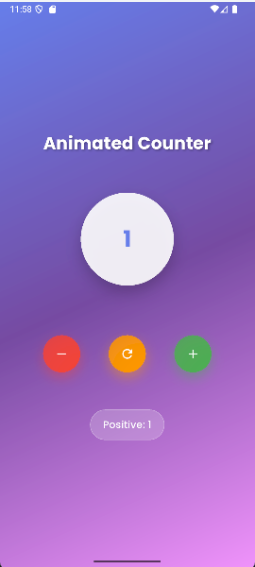

# Day 1 - Animated Counter App 

This is the first app from my **100 Days of Flutter Challenge**.  
It's a beautifully animated and elegant **Counter App** using Flutter.

## Preview

## Features
- Smooth counter animation using `AnimatedSwitcher`
- Gradient background for an aesthetic UI
- Custom fonts using `GoogleFonts`
- Floating Action Button (FAB) to increment the counter
- Responsive and simple layout

## Technologies & Packages Used
- Flutter SDK
- [google_fonts](https://pub.dev/packages/google_fonts)

